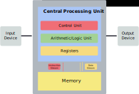
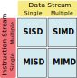

To make full use of computing resources the programmer needs to have a working knowledge of the parallel programming concepts and tools available for writing parallel applications. To build a basic understanding of how parallel computing works, let's start with an explanation of the components that comprise computers and their function.

### Von Neumann's Architecture

Von Neumann's architecture was first published by John von Neumann in 1945. It is based on the stored-program computer concept where computer memory is used to store both program instructions and data. Program instructions tell the computer to do something.

- Central Processing Unit:
    -  the electronic circuit responsible for executing the instructions of a computer program.
-  Memory Unit:
    - consists of random access memory (RAM) Unlike a hard drive (secondary memory), this memory is fast and directly accessible by the CPU.
- Arithmetic Logic Unit:
    - carries out arithmetic (add, subtract etc) and logic (AND, OR, NOT etc) operations.
- Control unit:
    - reads and interprets instructions from the memory unit.
    - controls the operation of the ALU, memory and input/output devices, telling them how to respond to the program instructions.
- Registers
    - Registers are high-speed storage areas in the CPU.  All data must be stored in a register before it can be processed.
- Input/Output Devices:
    - The interface to the human operator, e.g. keyboard, mouse, monitor, speakers, printer, etc.

Parallel computers still follow this basic design, just multiplied in units. The basic, fundamental architecture remains the same.

Parallel computers can be classified based on various criteria:
- number of data & instruction streams
- computer hardware structure (tightly or loosely coupled)
- degree of parallelism (the number of binary digits that can be processed within a unit time by a computer system)

Today there is no completely satisfactory classification of the different types of parallel systems. The most popular taxonomy of computer architecture is the Flynn's classification.

> ## Classifications of parallel computers
> 1. Flynn's classification: (1966) is based on the multiplicity of instruction streams and the data streams in computer systems.
> 2. Feng’s classification: (1972) is based on serial versus parallel processing (degree of parallelism).
> 3. Handler’s classification: (1977) is determined by the degree of parallelism and pipelining in various subsystem levels.
{: .callout}

### Flynn's classification of Parallel Computers

- Flynn’s classification scheme is based on the multiplicity of information streams. Two types of information flow into a processor: instructions and data.
- The instruction stream is defined as the sequence of instructions performed by the processing unit.
- The data stream is defined as the data traffic exchanged between the memory and the processing unit.

In Flynn’s classification, either of the instruction or data streams can be single or multiple. Thus computer architecture can be classified into the following four distinct categories:

#### SISD
Conventional single-processor von Neumann's computers are classified as SISD systems.

Examples:
Historical supercomputers such as the Control Data Corporation 6600.

#### SIMD

- The SIMD model of parallel computing consists of two parts: a front-end computer of the usual von Neumann style, and a processor array.
- The processor array is a set of identical synchronized processing elements capable of simultaneously performing the same operation on different data.
- The application program is executed by the front-end in the usual serial way, but issues commands to the processor array to carry out SIMD operations in parallel.

All modern desktop/laptop processors are classified as SIMD systems.

#### MIMD

- Multiple-instruction multiple-data streams (MIMD) parallel architectures are made of multiple processors and multiple memory modules connected via some interconnection network. They fall into two broad categories: **shared memory** or **message passing**.
- Processors exchange information through their central shared memory in shared memory systems, and exchange information through their interconnection network in message-passing systems.

##### MIMD shared memory system
- A shared memory system typically accomplishes inter-processor coordination through a global memory shared by all processors.
- Because access to shared memory is balanced, these systems are also called SMP (**symmetric multiprocessor**) systems

##### MIMD message passing system
- A message-passing system (also referred to as distributed memory) typically combines the local memory and processor at each node of the interconnection network.
- There is no global memory, so it is necessary to move data from one local memory to another employing message-passing.
- This is typically done by a Send/Receive pair of commands, which must be written into the application software by a programmer.

#### MISD
- In the MISD category, the same stream of data flows through a linear array of processors executing different instruction streams.
- In practice, there is no viable MISD machine


