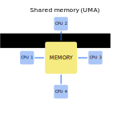
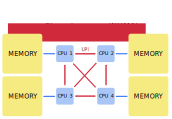
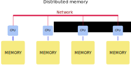
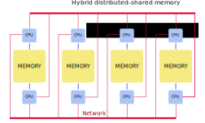

The organization of the memory system is second, equally important, aspect of high-performance computing. If the memory cannot keep up and provide instructions and data at a sufficient rate there will be no improvement in performance.

Processors are typically able to execute instructions much faster than
to read/write data from the main memory. Matching memory response to processor speed is very important for efficient parallel scaling. Solutions to the memory access problem have led to the development of two parallel memory architectures: shared memory and distributed memory.

The distinction between shared memory and distributed memory is an important one for programmers because it determines how different parts of a parallel program will communicate.

This section introduces techniques used to connect processors to memories in high-performance computers and how these techniques affect programmers.

### Shared memory

- Multiple processors can operate independently but share the same memory resources.
- All processors have equal access to data and instructions in this memory
- Changes in a memory done by one processor are visible to all other processors.

Based upon memory access times shared memory computers can be divided into two categories:

- Uniform Memory Access (UMA)
- Non-Uniform Memory Access (NUMA)

- All processors share memory uniformly, i.e. access time to a memory location is independent on which of the processors.

- Used in multiprocessor systems.
- When many CPUs are trying to access the same memory they can be "starved" of data because only one processor can access the computer's memory at a time.
- NUMA attempts to address this problem by providing separate memory for each processor.
- CPUs are physically linked using a fast interconnect.
- A CPU can access its local memory faster than non-local memory (memory local to another processor or memory shared between processors).

In a shared memory system it is only necessary to build a data structure in memory and pass references to the data structure to parallel subroutines. For example, a matrix multiplication routine that breaks matrices into a set of blocks only needs to pass the indices of each block to the parallel subroutines.

#### Advantages
- User-friendly programming.
- Fash data sharing due to a close connection between CPUs and memory

#### Disadvantages

- Not highly scalable. Adding more CPUs increases traffic on the shared memory-CPU path,
- Lack of data coherence. The change in the memory of one CPU needs to be reflected to the other processors, otherwise, the different processors will be working with incoherent data.
- The programmer is responsible for synchronization.

### Distributed memory

- In a distributed memory system each processor has a local memory that is not accessible from any other processor
- Programs on each processor interact with each other using some form of a network interconnect (Ethernet, Infiniband, Quadrics, etc.).
- A distributed memory program must create copies of shared data in each local memory. These copies are created by sending a message containing the data to another processor.

In the matrix multiplication example, the controlling process would have to send messages to other processors. Each message would contain all submatrices required to compute one part of the result. A drawback to this memory organization is that these messages might have to be quite large.

#### Advantages

- Each processor can use its local memory without interference from other processors.
-  There is no inherent limit to the number of processors; the size of the system is constrained only by the network used to connect processors.

#### Disadvantages

- The complexity of programming: the programmer is responsible for many of the details associated with data communication between processors.
- It may be difficult to map complex data structures from global memory, to distributed memory organization.
- Longer memory access times.

### Hybrid Distributed-Shared Memory

Practically all HPC computer systems today employ both shared and distributed memory architectures.

- The shared memory component can be a shared memory machine and/or graphics processing units (GPU).
- The distributed memory component is the networking of multiple shared memory/GPU machines.

The important advantage is increased scalability. Increased complexity of programming is an important disadvantage.

#### What memory model to implement?

The decision is usually based on the amount of information that must be shared by parallel tasks. Whatever information is shared among tasks must be copied from one node to another via messages in a distributed memory system, and this overhead may reduce efficiency to the point where a shared memory system is preferred.

The message passing style fits very well with the programs in which parts of a problem can be computed independently and require distributing only initialization data and collecting final results, for example, Monte-Carlo simulations.


