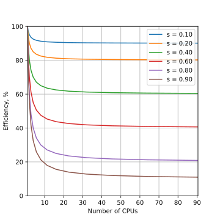

### Parallel Performance and Scalability.

#### Speedup
Parallel speedup is defined straightforwardly as ratio of the serial runtime of the best sequential algorithm to the time taken by the parallel algorithm to solve the same problem on $N$ processors:

$ SpeedUP = \frac{T_s}{T_p}$

Where $T_s$ is sequential runtime and $T_p$ is parallel runtime

Optimally, the speedup from parallelization would be linear. Doubling the number of processing elements should halve the runtime, and doubling it a second time should again halve the runtime.  That would mean that every processor would be contributing 100% of its computational power. However, very few parallel algorithms achieve optimal speedup. Most of them have a near-linear speedup for small numbers of processing elements, which flattens out into a constant value for large numbers of processing elements.

Typically a program solving a large problem consists of parallelizable and non-parallelizable parts and speedup depends on the fraction of parallelizable part of the problem.

#### Scalability

Scalability (also referred to as efficiency) is the ratio between the actual speedup and the ideal speedup obtained when using a certain number of processors. Considering that the ideal speedup of a serial program is proportional to the number of parallel processors:

$Efficiency=\frac{SpeedUP}{N}=\frac{T_s}{T_p*N}$

Efficiency can be also understood as the fraction of time for which a processor is usefully utilized.

- 0-100%
- Depends on number of processors
- Varies with size of the problem

When we writing a parallel application we want processors to be utilized efficiently.

#### Amdahl's law
The dependence of the maximum speedup of an algorithm on the number of parallel processes is described by the  Amdahl's law.

We can rewrite $T_s$ and $T_p$ in terms of parallel overhead cost $K$, serial fraction of code $S$, parallel fraction of code $P$ and the number of processes $N$:

$T_s = S + P$
$T_p = S + \frac{P}{N} + K$

Assuming that $K$ is negligibly small (very optimistic) and considering that $S+P=1$:

$$ SpeedUP = \frac{T_s}{T_p}=\frac{1}{S+\frac{P}{N}} $$

This equation is known as Amdahl's law. It states that the speedup of a program from parallelization is limited by a fraction of  program that can be parallelized.

For example, if 50% of the program can be parallelized, the maximum speedup using parallel computing would be 2 no matter how many processors are used.

| Speed Up| Efficiency |
:---:|:---:
| | |

Amdahl's law highlights that no matter how fast we make the parallel part of the code, we will always be limited by the serial portion.

It implies that parallel computing is only useful when the number of processors is small, or when the problem is perfectly parallel, i.e., embarrassingly parallel. Amdahl's law is a majpor obstacle in boosting parallel performance.

Amdahl's law assumes that the total amount of work is *independent of the number of processors* (fixed-size problem).

This type of problem scaling is referred to as *Strong Scaling*.

#### Gustafson's law

In practice users should increase the size of the problem as more processors are added. The run-time scaling for this scenario is called *Weak Scaling*.

If we assume that the total amount of work to be done in parallel *varies linearly* with the number of processors, speedup will be given by the Gustafson's law:

$$\large{SpeedUp = N − S * (N − 1)}$$

where $N$ is the number of processors and $S$ is the serial fraction as before.

| Speed Up| Efficiency |
:---:|:---:
||

Theoretical speedup is more optimistic in this case. We can see that any sufficiently large problem can be solved in the same time by using more processors.

Basically, we use larger systems with more processors to solve larger problems.

### Measuring parallel Scaling

When running jobs on Compute Canada HPC systems is recommended to measure the parallel scaling of your problem.

- To test for strong scaling we measure how the wall time of the job scales with the number of processing elements (openMP threads or MPI processes).
- To test for weak scaling we increase both the job size and the number of processing elements.

The results from these tests will allow to determine the amount of resources optimal for the size of the particular job.

Exercise.

The example OpenMP program calculates an image of a [Julia set](https://people.sc.fsu.edu/~jburkardt/c_src/julia_set/julia_set.html) written by [John Burkardt](https://people.sc.fsu.edu/~jburkardt/) and released under the GNU LGPL license.

The program is modified to take width, height and number of threads as an arguments.

To test the strong scaling run the program with width=1000, height=2000 and different numbers of threads. Record computational time for each calculation.

To measure weak scaling running the code with different numbers of threads and with a correspondingly scaled width*height. For simplicity you can keep width constant and scale only heigh.

Fit the strong and weak scaling results with  Amdahl’s and Gustafson’s equations to obtain the ratio of the serial part (s) and the parallel part (p).

#### Communication costs

Latency is the time from when the first bit leaves the transmitter until the last is received.

References:

1. Amdahl, Gene M. (1967). AFIPS Conference Proceedings. (30): 483–485. doi: 10.1145/1465482.1465560
2. Gustafson, John L. (1988). Communications of the ACM. 31 (5): 532–533. doi: 10.1145/42411.42415
3. [Infiniband latency data](https://doi.org/10.5815/ijcnis.2016.10.02)
