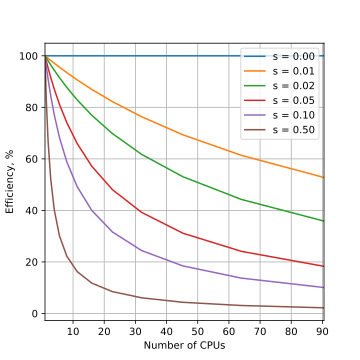
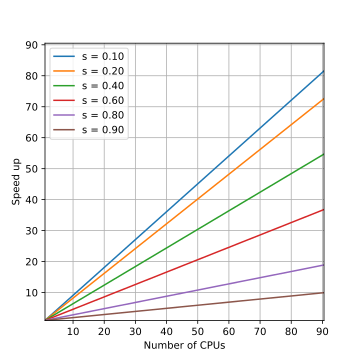

### Parallel Performance and Scalability.

#### Speedup
Parallel speedup is defined straightforwardly as ratio of the serial runtime of the best sequential algorithm to the time taken by the parallel algorithm to solve the same problem on $N$ processors:

$ SpeedUP = \frac{T_s}{T_p}$

Where $T_s$ is sequential runtime and $T_p$ is parallel runtime

Optimally, the speedup from parallelization would be linear. Doubling the number of processing elements should halve the runtime, and doubling it a second time should again halve the runtime.  That would mean that every processor would be contributing 100% of its computational power. However, very few parallel algorithms achieve optimal speedup. Most of them have a near-linear speedup for small numbers of processing elements, which flattens out into a constant value for large numbers of processing elements.

Typically a program solving a large problem consists of parallelizable and non-parallelizable parts and speedup depends on the fraction of parallelizable part of the problem.

#### Scalability

Scalability (also referred to as efficiency) is the ratio between the actual speedup and the ideal speedup obtained when using a certain number of processors. Considering that the ideal speedup of a serial program is proportional to the number of parallel processors:

$Efficiency=\frac{SpeedUP}{N}=\frac{T_s}{T_p*N}$

Efficiency can be also understood as the fraction of time for which a processor is usefully utilized.

- 0-100%
- Depends on number of processors
- Varies with size of the problem

When we writing a parallel application we want processors to be utilized efficiently.

#### Amdahl's law
The dependence of the maximum speedup of an algorithm on the number of parallel processes is described by the  Amdahl's law.

We can rewrite $T_s$ and $T_p$ in terms of parallel overhead cost $K$, serial fraction of code $S$, parallel fraction of code $P$ and the number of processes $N$:

$T_s = S + P$
$T_p = S + \frac{P}{N} + K$

Assuming that $K$ is negligibly small (very optimistic) and considering that $S+P=1$:

$$ SpeedUP = \frac{T_s}{T_p}=\frac{1}{S+\frac{P}{N}} $$

This equation is known as Amdahl's law. It states that the speedup of a program from parallelization is limited by a fraction of  program that can be parallelized.

For example, if 50% of the program can be parallelized, the maximum speedup using parallel computing would be 2 no matter how many processors are used.

| Speed Up| Efficiency |
:---:|:---:
| | |

Amdahl's law highlights that no matter how fast we make the parallel part of the code, we will always be limited by the serial portion.

It implies that parallel computing is only useful when the number of processors is small, or when the problem is perfectly parallel, i.e., embarrassingly parallel. Amdahl's law is a majpor obstacle in boosting parallel performance.

Amdahl's law assumes that the total amount of work is *independent of the number of processors* (fixed-size problem).

This type of problem scaling is referred to as *Strong Scaling*.

#### Gustafson's law

In practice users should increase the size of the problem as more processors are added. The run-time scaling for this scenario is called *Weak Scaling*.

If we assume that the total amount of work to be done in parallel *varies linearly* with the number of processors, speedup will be given by the Gustafson's law:

$$\large{SpeedUp = N − S * (N − 1)}$$

where $N$ is the number of processors and $S$ is the serial fraction as before.

| Speed Up| Efficiency |
:---:|:---:
||

Theoretical speedup is more optimistic in this case. We can see that any sufficiently large problem can be solved in the same time by using more processors.

Basically, we use larger systems with more processors to solve larger problems.

### Measuring Parallel Scaling

It is important to measure the parallel scaling of your problem before running production jobs.

- To test for strong scaling we measure how the wall time of the job scales with the number of processing elements (openMP threads or MPI processes).
- To test for weak scaling we increase both the job size and the number of processing elements.

The results from these tests allow to determine optimal amount of CPUs for a job.

#### Example problem.

The example OpenMP program calculates an image of a [Julia set](https://people.sc.fsu.edu/~jburkardt/c_src/julia_set/julia_set.html). It is written by [John Burkardt](https://people.sc.fsu.edu/~jburkardt/) and released under the GNU LGPL license.

The program is modified to take width, height and number of threads as an arguments. It will print the number of threads used and computation time on screen. It will also append these numbers into the file 'output.csv' for analysis. You could repeat each computation several times to improve accuracy.

The algorithm finds a set of points in a 2D rectangular
domain with width W and height H that are associated with Julia set.

The idea behind Julia set is choosing two complex numbers $z_0$ and $c$, and then repeatedly evaluating

 $$z_{n+1}=z_{n}^2+c$$

For each complex constant $c$ one gets a different Julia set. The initial value $z_0$ for the series is each point in the image plane.

To construct the image each pixel (x,y) is mapped to a rectangular region of the complex plane:  $z_0=x+iy$. Each pixel then represents the starting point for the series, $z_0$. The series is computed for each pixel and if it diverges to infinity it is drawn in white, if it doesn't then it is drawn in red.

In this implementation of the algorithm up to the maximum of 200 iterations for each point $z$ is carried out. If the value of $\lvert z \lvert$ exceeds 1000 at any iteration, $z$ is not in the Julia set.

To test the strong scaling run the program with width=2000, height=2000 and different numbers of threads (1-16).

To measure weak scaling we run the code with different numbers of threads and with a correspondingly scaled width and height.

Once the runs are completed we fit the strong and weak scaling results with  Amdahl’s and Gustafson’s equations to obtain the ratio of the serial part (s) and the parallel part (p).

#### Compiling and Running

1. Compile the program *julia_set_openmp.c*
    ~~~
    gcc -fopenmp julia_set_openmp.c
    ~~~
    {: .source}

2. Run on 2 CPUs
    ~~~
    ./a.out 2000 2000 2
    ~~~
    {: .source}
    ~~~
    JULIA_OPENMP:
      C/OpenMP version.
      Plot a version of the Julia set for Z(k+1)=Z(k)^2-0.8+0.156i
      Using 2 threads max, 0.195356 seconds

    TGA_WRITE:
      Graphics data saved as 'julia_openmp.tga'

    JULIA_OPENMP:
      Normal end of execution.
    ~~~
    {: .output}

    The program generates image file *julia_openmp.tga*:
    

3. To measure strong scaling submit array job: *sbatch submit_strong.sh*
    ~~~
    #!/bin/bash
    #SBATCH -A def-somebody
    #SBATCH --cpus-per-task=16
    #SBATCH --time=1:0
    #SBATCH --array=1-16%1 # Run 16 jobs, one job at a time

    rm output.csv
    # Run the code 3 times to get some statistics
    ./a.out 2000 2000 $SLURM_ARRAY_TASK_ID
    ./a.out 2000 2000 $SLURM_ARRAY_TASK_ID
    ./a.out 2000 2000 $SLURM_ARRAY_TASK_ID
    ~~~
    {: .source}

    Timing results will be saved in *output.csv*

4. Fit data with Amdahl's law equation: *strong_scaling.py*

#### Static vs. Dynamic Schedule
Schedule refers to the way the individual values of the loop variable, are spread across the threads. Static means that it is decided at the beginning which thread will do which values. Dynamic means that each thread will work on a chunk of values and then take the next chunk which hasn't been worked on by any thread. The latter allows better balancing (in case the work varies between different values for the loop variable), but requires some communication overhead.

#### Communication costs

Latency is the time from when the first bit leaves the transmitter until the last is received.

References:

1. Amdahl, Gene M. (1967). AFIPS Conference Proceedings. (30): 483–485. doi: 10.1145/1465482.1465560
2. Gustafson, John L. (1988). Communications of the ACM. 31 (5): 532–533. doi: 10.1145/42411.42415
3. [Infiniband latency data](https://doi.org/10.5815/ijcnis.2016.10.02)

### Input and Output

Objectives
- Sketch the storage structure of a generic, typical cluster
- Understand the terms “local disk”, “IOPS”, “SAN”, “metadata”, “parallel I/O”

[Intel SSD](https://www.intel.ca/content/www/ca/en/products/docs/memory-storage/solid-state-drives/data-center-ssds/dc-p4610-p4618-series-brief.html)
[HDF5](https://portal.hdfgroup.org/display/HDF5/HDF5)
[LUSTRE](http://lustre.org/about/)
[GPFS](https://www.ibm.com/support/knowledgecenter/en/STXKQY_4.2.0/com.ibm.spectrum.scale.v4r2.ins.doc/bl1ins_intro.htm)
[IOR](https://ior.readthedocs.io/en/latest/index.html)

Cluster storage
Recall what you learned about cluster architecture in the Intro to ACENET, or look at the video here: https://www.youtube.com/watch?v=VxmTbDfelmA

There is a login node (or maybe more than one).
There might be a data transfer node (DTN), which is basically a login node specially designated for doing (!) data transfers.
There are a lot of compute nodes. The compute nodes may or may not have local disk.
Most I/O goes to a storage array or SAN (Storage Array Network).
Broadly, you have two choices: You can do I/O to the node-local disk (if there is any), or you can do I/O to the SAN. Local disk suffers little or no contention, but is inconvenient.

Local disk
What are the inconveniences of local disk? What sort of work patterns suffer most from this? What suffers least? That is, what sort of jobs can use local disk most easily?
Local disk performance depends on a lot of things. If you’re interested you can get an idea from here: What-is-the-throughput-of-15k-rpm-sas-drive

For that particular disk model, throughput 16MB/s to 200MB/s depending on how you do it
IOPS (IO operations per second) 150-200
Most input and output on a cluster goes through the SAN.

There are many architectural choices made in constructing a SAN.

What technology? Lustre popular these days. ACENET & Compute Canada use it. GPFS is another…
How many servers, and how many disks in each? What disks?
How many MDS? MDS = MetaData Server. Things like ‘ls’ only require metadata. Exactly what is handled by the MDS (or even if there is one) may depend on the technology chosen (e.g. Lustre).
What switches and how many of them?
Are things wired together with fibre or with ethernet? What’s the wiring topology?
Where is there redundancy or failovers, and how much? This is all the domain of the sysadmins, but what should you as the user do about it?
If you’re doing parallel computing you have further choices about how you do that.

File-per-process is reliable, portable and simple, but lousy for checkpointing and restarting.

Many small files on a SAN (or anywhere, really) leads to metadata bottlenecks. Most HPC filesystems assume no more than 1,000 files per directory.

Parallel I/O (e.g. MPI-IO) -> many processes, one file
Solves restart problems, but requires s/w infrastructure and programming

High-level interfaces like NetCDF and HDF5 are highly recommended
I/O bottlenecks:
Disk read-write rate. Alleviated by striping.
Fibre bandwidth (or Ethernet or …)
Switch capacity.
Metadata accesses (especially if only one MDS)
Measuring I/O rates
Look into IOR on GitHub or SourceForge
Read this 2007 paper, Using IOR to Analyze the I/O performance for HPC Platforms
Neither of these are things to do right this minute!
— Takeaways:

I/O is complicated. If you really want to know what performs best, you’ll have to experiment.
A few large IO operations are better than many small ones.
A few large files are usually better than many small files.
High-level interfaces (e.g. HDF5) are your friend, but even they’re not perfect.
Moving data on and off a cluster
“Internet” cabling varies a lot. 100Mbit/s widespread, 1Gbit becoming common, 10Gbit or more between most CC sites
Canarie is the Cdn research network. Check out their “weather map”
Firewalls sometimes the problem - security versus speed

Filesystem at sending or receiving end often the bottleneck (SAN or simple disk)
What are typical disk I/O rates? See above! Highly variable!
Estimating transfer times
How long to move a gigabyte at 100Mbit/s?
How long to move a terabyte at 1Gbit/s?
Solution
Remember a byte is 8 bits, a megabyte is 8 megabits, etc.

1024MByte/GByte * 8Mbit/MByte / 100Mbit/sec = 81 sec
8192 sec = 2 hours and 20 minutes
Remember these are “theoretical maximums”! There is almost always some other bottleneck or contention that reduces this!
Restartable downloads (wget? rsync? Globus!)
checksumming (md5sum) to verify integrity of large transfers
