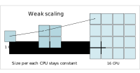

#### Speedup
The parallel speedup is defined straightforwardly as the ratio of the serial runtime of the best sequential algorithm to the time taken by the parallel algorithm to solve the same problem on $N$ processors:

$$ SpeedUP = \frac{T_s}{T_p}$$

Where $T_s$ is sequential runtime and $T_p$ is parallel runtime

Optimally, the speedup from parallelization would be linear. Doubling the number of processing elements should halve the runtime, and doubling it a second time should again halve the runtime.  That would mean that every processor would be contributing 100% of its computational power. However, very few parallel algorithms achieve optimal speedup. Most of them have a near-linear speedup for small numbers of processing elements, which flattens out into a constant value for large numbers of processing elements.

Typically a program solving a large problem consists of the parallelizable and non-parallelizable parts and speedup depends on the fraction of parallelizable part of the problem.

#### Scalability

Scalability (also referred to as efficiency) is the ratio between the actual speedup and the ideal speedup obtained when using a certain number of processors. Considering that the ideal speedup of a serial program is proportional to the number of parallel processors:

$$Efficiency=\frac{SpeedUP}{N}=\frac{T_s}{T_p*N}$$

Efficiency can be also understood as the fraction of time for which a processor is usefully utilized.

- 0-100%
- Depends on the number of processors
- Varies with the size of the problem

When we writing a parallel application we want processors to be utilized efficiently.

#### Amdahl's law
The dependence of the maximum speedup of an algorithm on the number of parallel processes is described by Amdahl's law.

We can rewrite $T_s$ and $T_p$ in terms of parallel overhead cost $K$, the serial fraction of code $S$, the parallel fraction of code $P$ and the number of processes $N$:

$$T_s = S + P$$

$$T_p = S + \frac{P}{N} + K$$

Assuming that $K$ is negligibly small (very optimistic) and considering that $S+P=1$:

$$ SpeedUP = \frac{T_s}{T_p}=\frac{1}{S+\frac{P}{N}} $$

This equation is known as Amdahl's law. It states that the speedup of a program from parallelization is limited by a fraction of a program that can be parallelized.

For example, if 50% of the program can be parallelized, the maximum speedup using parallel computing would be 2 no matter how many processors are used.

| Speed Up| Efficiency |
:---:|:---:
| | |

Amdahl's law highlights that no matter how fast we make the parallel part of the code, we will always be limited by the serial portion.

It implies that parallel computing is only useful when the number of processors is small, or when the problem is perfectly parallel, i.e., embarrassingly parallel. Amdahl's law is a major obstacle in boosting parallel performance.

Amdahl's law assumes that the total amount of work is *independent of the number of processors* (fixed-size problem).

This type of problem scaling is referred to as *Strong Scaling*.

#### Gustafson's law

In practice, users should increase the size of the problem as more processors are added. The run-time scaling for this scenario is called *Weak Scaling*.

If we assume that the total amount of work to be done in parallel *varies linearly* with the number of processors, speedup will be given by the Gustafson's law:

$$\large{SpeedUp = N − S * (N − 1)}$$

where $N$ is the number of processors and $S$ is the serial fraction as before.

| Speed Up| Efficiency |
:---:|:---:
||

The theoretical speedup is more optimistic in this case. We can see that any sufficiently large problem can be solved in the same amount of time by using more processors. We can use larger systems with more processors to solve larger problems.

#### Example problem with weak scaling.
Imagine that you are working on a numeric weather forecast for some country. To predict the weather, you need to divide the whole area into many small cells and run the simulation. Let's imagine that you divided the whole area into 10,000 cells with a size of 50x50 km and simulation of one week forecast took 1 day on 1 CPU. You want to improve forecast accuracy to 10 km. In this case, you would have 25 times more cells. The volume of computations would increase proportionally and you would need 25 days to complete forecast. This is unacceptable and you increase the number of CPUs to 25 hoping to complete the job in 1 day.
#### Example problem with strong scaling.
Imagine that you want to analyze customer transactional data for 2019. You cannot add more transactions to your analysis because there was no more.
This is fixed-size problem and it will follow strong scaling law.

Any real-life problem falls in one of these 2 categories. Type of scaling is a property of a problem that cannot be changed, but we can change the number of processing elements so that we utilize them efficiently to solve a problem.

> ## Measuring Parallel Scaling
>
>It is important to measure the parallel scaling of your problem before running long production jobs.
>
> - To test for strong scaling we measure how the wall time of the job scales with the number of processing elements (openMP threads or MPI processes).
> - To test for weak scaling we increase both the job size and the number of processing elements.
> - The results from these tests allow us to determine the optimal amount of CPUs for a job.
{: .callout}

#### Example problem.

The example OpenMP program calculates an image of a [Julia set](https://people.sc.fsu.edu/~jburkardt/c_src/julia_set/julia_set.html). It is written by [John Burkardt](https://people.sc.fsu.edu/~jburkardt/) and released under the GNU LGPL license.

The program is modified to take width, height and number of threads as arguments. It will print the number of threads used and computation time on screen. It will also append these numbers into the file 'output.csv' for analysis. You could repeat each computation several times to improve accuracy.

The algorithm finds a set of points in a 2D rectangular
domain with width W and height H that are associated with Julia set.

The idea behind Julia set is choosing two complex numbers $z_0$ and $c$, and then repeatedly evaluating

 $$z_{n+1}=z_{n}^2+c$$

For each complex constant $c$ one gets a different Julia set. The initial value $z_0$ for the series is each point in the image plane.

To construct the image each pixel (x,y) is mapped to a rectangular region of the complex plane:  $z_0=x+iy$. Each pixel then represents the starting point for the series, $z_0$. The series is computed for each pixel and if it diverges to infinity it is drawn in white, if it doesn't then it is drawn in red.

In this implementation of the algorithm up to the maximum of 200 iterations for each point, $z$ is carried out. If the value of $\lvert z \lvert$ exceeds 1000 at any iteration, $z$ is not in the Julia set.

> ## Running strong and weak scaling tests
> We can run this sample program in both strong and weak scaling modes.
> - To test the strong scaling run the program with fixed size (width=2000, height=2000) and different numbers of threads (1-16).
>
> - To measure weak scaling we run the code with different numbers of threads and with a correspondingly scaled width and height.
>
>Once the runs are completed we fit the strong and weak scaling results with  Amdahl’s and Gustafson’s equations to obtain the ratio of the serial part (s) and the parallel part (p).
{: .callout}

#### Compiling and Running the Example

1. Download and unpack the code:
    ~~~
    wget https://github.com/ssvassiliev/Summer_School_General/raw/master/code/julia_set.tar.gz
    tar -xf julia_set.tar.gz
    ~~~
    {: .source}

1. Compile the program *julia_set_openmp.c*
    ~~~
    gcc -fopenmp julia_set_openmp.c
    ~~~
    {: .source}

2. Run on 2 CPUs
    ~~~
    ./a.out 2000 2000 2
    ~~~
    {: .source}
    ~~~
    JULIA_OPENMP:
      C/OpenMP version.
      Plot a version of the Julia set for Z(k+1)=Z(k)^2-0.8+0.156i
      Using 2 threads max, 0.195356 seconds

    TGA_WRITE:
      Graphics data saved as 'julia_openmp.tga'

    JULIA_OPENMP:
      Normal end of execution.
    ~~~
    {: .output}

    The program generates image file *julia_openmp.tga*:
    

3. To measure strong scaling submit array job: *sbatch submit_strong.sh*
    ~~~
    #!/bin/bash
    #SBATCH -A def-sponsor0
    #SBATCH --cpus-per-task=16
    #SBATCH --time=1:0
    #SBATCH --array=1-16%1 # Run 16 jobs, one job at a time

    # Run the code 3 times to get some statistics
    ./a.out 2000 2000 $SLURM_ARRAY_TASK_ID
    ./a.out 2000 2000 $SLURM_ARRAY_TASK_ID
    ./a.out 2000 2000 $SLURM_ARRAY_TASK_ID
    ~~~
    {: .source}

    Timing results will be saved in *output.csv*

4. Fit data with Amdahl's law
    ~~~
    module load python scipy-stack
    mv output.csv strong_scaling.csv
    python strong_scaling.py
    ~~~
    {: .source}
    

> ## Testing weak scaling
>
> 1. Modify the submission script to test weak scaling and rerun the test.
> 2. Modify python script to fit weak scaling data (Increase both the number of pixels and the number of CPUs). Compare serial fraction and speedup values obtained using stong and weak scaling tests.
>
> > ## Solution
> > Submission script for measuring weak scaling
> > ~~~
> > #!/bin/bash
> > #SBATCH -A def-sponsor0
> > #SBATCH --cpus-per-task=16
> > #SBATCH --time=10:00
> > #SBATCH --array=1-16%1
> > N=$SLURM_ARRAY_TASK_ID
> > w=2000
> > h=2000
> > sw=$(printf '%.0f' `echo "scale=6;sqrt($N)*$w" | bc`)
> > sh=$(printf '%.0f' `echo "scale=6;sqrt($N)*$h" | bc`)
> >./a.out $sw $sh $N
> >./a.out $sw $sh $N
> >./a.out $sw $sh $N
> > ~~~
> > {: .source}
> > To simplify the submission script you could scale only width.
> >
> > Use Gustafson's law function to fit weak scaling data:
> > ~~~
> > def gustafson(ncpu, p):
> >    return ncpu-(1-p)*(ncpu-1)
> > ~~~
> > {: .source}
> > Full script 'submit_weak.sh' is included in julia_set.tar.gz
> {: .solution}
{: .challenge}

#### Scheduling Threads in OpenMP.
The schedule refers to the way the individual values of the loop variable, are spread across the threads. A static schedule means that it is decided at the beginning which thread will do which values. Dynamic means that each thread will work on a chunk of values and then take the next chunk which hasn't been worked on by any thread. The latter allows better balancing (in case the work varies between different values for the loop variable), but requires some communication overhead.

> ## Improving Parallel Performance
>
> Add 'schedule(dynamic)' statement to #pragma OpenMP block (line 146), recompile the code and rerun strong scaling test.
> Compare test results with and without dynamic scheduling.
>
> Why dynamic scheduling improves parallel speedup for this problem?
{: .challenge}

References:

1. Amdahl, Gene M. (1967). AFIPS Conference Proceedings. (30): 483–485. doi: 10.1145/1465482.1465560
2. Gustafson, John L. (1988). Communications of the ACM. 31 (5): 532–533. doi: 10.1145/42411.42415


